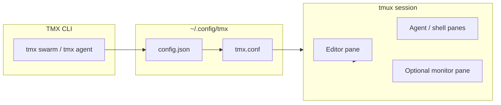

# TMX 10x

**A Rust CLI that turns tmux into an agentic workspace for AI development.**

Managing multiple autonomous AI agents (like Claude Code, Codex, Aider) in the terminal often leads to "terminal sprawl", lost scrollback logs, and — worst of all — agents **clobbering each other's files** when you run them in parallel. `tmx` solves all of this by automatically configuring `tmux` with powerful features tailored for AI development—without modifying your global `~/.tmux.conf`.

[](LICENSE)
[](https://www.rust-lang.org/)
[](https://github.com/tmux/tmux)

## 🐝 The hero feature: Parallel Agent Swarm

```bash
cd my-project
tmx swarm "add a dark mode toggle"
```

`tmx swarm` spawns **N AI agents in parallel, each in its own isolated git worktree + branch**, so they never step on each other. When they're done, `tmx review` shows you a plain-language diff of what each agent did and lets you **keep the best one** (it merges the branch) and discard the rest — no git knowledge required.

> Try three approaches at once. Keep the one you like. Throw away the rest with one keypress.

---

## Table of contents

- [Why TMX?](#why-tmx)
- [Features](#-features)
- [Parallel Agent Swarm](#-parallel-agent-swarm-worktree-isolation)
- [Workspace layouts](#-workspace-layouts)
- [Magical UX](#-magical-ux)
- [Installation](#-installation)
- [Quick start](#-quick-start)
- [CLI reference](#-cli-commands)
- [Keyboard shortcuts](#-power-shortcuts)
- [Configuration](#-configuration)
- [Platform notes](#platform-notes)
- [Development](#development)
- [Contributing](#-contributing)
- [License](#-license)

---

## Why TMX?

Working with autonomous AI agents in the terminal creates predictable pain:

| Problem | TMX solution |
| --- | --- |
| Too many terminals and lost context | Named workspaces with preset multi-pane layouts |
| Agents overwrite each other's files | `tmx swarm` isolates each agent in its own git worktree + branch |
| Agent output scrolls away forever | Yank scrollback, auto-log to disk, one-click crash reports |
| Accidental keystrokes interrupt agents | Per-pane lock mode |
| Hard to monitor many agents at once | `tmx ps` dashboard, live `tmx monitor`, and input-wait badges |
| tmux config is intimidating | Zero-touch setup—config lives in `~/.config/tmx`, not your global tmux |

TMX never modifies `~/.tmux.conf`. It generates a dedicated config and passes it to tmux with `-f`.



## ✨ Features

- **🐝 Parallel Agent Swarm:** `tmx swarm "<task>"` runs multiple agents at once, each isolated in its own git worktree + branch — zero file collisions.
- **🔍 Review & Keep the Best:** `tmx review` summarizes each agent's changes in plain language and merges your favorite branch (hiding git entirely).
- **🤖 Agent Presets:** Auto-detects installed agent CLIs (Claude Code, Codex, Cursor CLI, Aider, Gemini, OpenCode) and launches them for you.
- **🔔 Finish / Idle Notifications:** `tmx monitor` watches every agent and sends a desktop notification when one finishes or needs your input.
- **🩺 Doctor:** `tmx doctor` checks tmux, git, truecolor, clipboard, and which agents are installed.
- **🏗️ Dynamic Layouts:** Instantly spin up Dev (3-pane), Swarm (4-pane agent grid), or Observer (2-pane with live monitor) layouts.
- **🎨 Swarm Splash Screens:** Each pane in Swarm mode gets a unique background color, ASCII mascot, and optional `fastfetch`/`neofetch` graphics on launch.
- **🌈 Funky Window Tabs:** Every tmux window (tab) gets its own status-bar color and matching pane background. New tabs (`Prefix + c`) cycle through a 6-color palette automatically.
- **🌐 Global Dashboard:** Run `tmx ps` to see a global dashboard of all running agents and their last 3 lines of output across all sessions.
- **📡 Live Monitor:** Run `tmx monitor` for a full-screen dashboard that refreshes every 2 seconds.
- **📋 Instant Yank:** Press `Prefix + y` to instantly copy the last 200 lines of agent output directly to your system clipboard (bypasses tmux copy-mode).
- **🖨️ Auto-Logger:** Press `Prefix + P` to toggle piping the active pane's output to a log file on your hard drive.
- **🔒 Safe Lock Mode:** Press `Prefix + L` to lock keyboard input for a pane; `Prefix + U` to unlock (pane colors are preserved).
- **💾 1-Click Crash Reporter:** Press `Prefix + S` to save the active pane's scrollback history to a `tmx_crash.log` file in the current directory.
- **⚡ Popup Switcher:** Hit `Prefix + w` for an interactive menu to jump between active workspaces.
- **🧠 Muscle-Memory Builder:** Full mouse support with toast notifications teaching keyboard shortcuts.
- **🤖 Scripting-Friendly:** `--no-attach` and `-s/--session` flags for CI, automation, and detached workflows.

## 🛠️ Installation

**One-line install (prebuilt binary — no Rust required):**

```bash
curl --proto '=https' --tlsv1.2 -sSf https://raw.githubusercontent.com/krunalparmarem/tmx/main/install.sh | bash
```

The script downloads a prebuilt binary for your platform (macOS arm64/x86_64, Linux x86_64/arm64) from the latest GitHub Release and drops it on your `PATH`. If no prebuilt binary matches your platform, it automatically falls back to building from source with `cargo`.

**Homebrew (macOS/Linux):**

```bash
brew install krunalparmarem/tmx/tmx
```

**From source (requires Rust):**

```bash
cargo install --git https://github.com/krunalparmarem/tmx.git
```

*Note: `tmux` is required at runtime, and `git` is required for `tmx swarm` / `tmx review`. Run `tmx doctor` after installing to check your setup.*

Maintainers: pushing a `v*` tag triggers `.github/workflows/release.yml`, which builds and attaches the prebuilt binaries the installer downloads.

## 🚀 Quick Start

Run `tmx` from your terminal to launch the interactive menu.

```bash
tmx
```

### Initial Setup

The very first time you run `tmx`, it will interactively prompt you to configure:

1. **Your Prefix Key** (e.g., `C-a`, `Option-Space`). You can simply *press* the key!
2. **Your Editor Command** (e.g., `cursor .`, `code .`, `vim`)
3. **Your Environment Command** (e.g., `source venv/bin/activate`, `nvm use 18`)
4. **Your Workspace Root** (e.g., `~/Projects` — where agent project directories are created)

*Need to change your settings later? Just run `tmx config`!*

Configuration is stored in `~/.config/tmx/config.json`. A generated `~/.config/tmx/tmx.conf` is written on every run (your global `~/.tmux.conf` is never touched).

### Interactive Menu

Running `tmx` with no subcommand opens a menu:

| Option | Action |
| --- | --- |
| Spawn Parallel Agents (Swarm) | Launch `tmx swarm` — pick task, agent count, and go |
| Review Swarm & Keep the Best | Launch `tmx review` — diff agents and merge your favorite |
| Create Agent Workspace | Launch `tmx agent` flow with layout picker and spawn ritual |
| Switch / Attach to Session | Interactive session picker |
| Global Dashboard (ps) | One-shot pane status view (returns to menu) |
| Live Monitor | Full-screen refreshing dashboard with log diff highlighting |
| Doctor (health check) | Diagnose tmux, git, terminal, clipboard, and agents |
| Change Configuration | Re-run setup prompts |
| Kill Session | Interactive session killer |
| Cheatsheet | Print keyboard shortcuts |
| Exit | Leave the menu |

## 🐝 Parallel Agent Swarm (Worktree Isolation)

The flagship workflow. From inside any git repository:

```bash
tmx swarm "refactor the auth module to use JWT"
tmx swarm -n 4 "add pagination to the users list"   # 4 agents
tmx swarm --no-attach "write tests for the parser"   # detached (CI/scripts)
```

What happens:

1. `tmx` creates one **git worktree + branch per agent** under `.tmx-trees/<session>/<codename>` (branches named `tmx/<session>/<codename>`). `.tmx-trees/` is auto-added to your `.gitignore`.
2. It opens a tiled tmux window with one pane per agent, each `cd`'d into its own worktree, and launches your configured agent seeded with the task prompt.
3. Because each agent has its own working copy, **they never overwrite each other's files.**

Re-running `tmx swarm` in the same repo reuses the session name derived from the folder (e.g. `tmx`). If a tmux session with that name is already running, tmx picks `tmx-2`, `tmx-3`, etc. If a previous swarm left orphaned worktrees/branches (e.g. after a crash or rollback), tmx offers to clean them up automatically. If saved agent work still exists, you'll be prompted to review it first with `tmx review`.

```
┌──────────┬──────────┐
│ ALPHA    │ BRAVO    │   each pane = its own git worktree + branch
├──────────┼──────────┤   running the same task, in isolation
│ CHARLIE  │ DELTA    │
└──────────┴──────────┘
```

When the agents finish, review and pick a winner:

```bash
tmx review              # or Prefix + r inside tmux
```

`tmx review` shows each agent's changes in plain language (files changed, lines added/removed). Choose **Keep ALPHA** and `tmx` commits any pending work, merges `tmx/<session>/alpha` into your base branch, and offers to clean up all the worktrees, branches, and the tmux session. Choose **Discard all** to throw everything away. Merge conflicts are surfaced in plain language with an option to open your editor.

> Not in a git repo? `tmx swarm` offers to `git init` one for you — perfect for non-technical users starting a brand-new project.

### Agents

`tmx` auto-detects these agent CLIs on your `PATH` during setup (`tmx config` to re-detect):

| Agent | Binary | Command template |
| --- | --- | --- |
| Claude Code | `claude` | `claude {task}` |
| Codex CLI | `codex` | `codex {task}` |
| Cursor CLI | `cursor-agent` | `cursor-agent {task}` |
| Aider | `aider` | `aider --message {task}` |
| Gemini CLI | `gemini` | `gemini {task}` |
| OpenCode | `opencode` | `opencode {task}` |

The `{task}` placeholder is replaced with your (safely shell-quoted) prompt. You can edit or add agents in `~/.config/tmx/config.json`.

## 🏗️ Workspace Layouts

When you run `tmx agent <name>`, you pick one of three layouts:

### Dev Mode (3 panes)

```
┌────────────┬──────────┐
│            │  Server  │
│   Editor   ├──────────┤
│            │  Shell   │
└────────────┴──────────┘
```

Each pane launches with a **subtle background color**, **ASCII splash art**, and a **tmux pane title**:

| Pane | Title | Role |
| --- | --- | --- |
| 1 | **Editor** | Runs your configured `editor_cmd` (e.g. `cursor .`) |
| 2 | **Server** | Runs your configured `env_cmd` |
| 3 | **Shell** | Runs your configured `env_cmd` |

### Swarm Mode (4-pane agent grid)

```
┌──────────┬──────────┐
│ Agent 1  │ Agent 2  │
├──────────┼──────────┤
│ Agent 3  │ Agent 4  │
└──────────┴──────────┘
```

Each pane launches with a **unique background color**, **ASCII mascot art**, and an optional system info graphic (`fastfetch` or `neofetch`, if installed):

| Pane | Codename | Background | Theme |
| --- | --- | --- | --- |
| 1 | **ALPHA** | Deep purple `#2d1b4e` | Robot mascot |
| 2 | **BRAVO** | Forest green `#1b3d32` | Lightning bolt |
| 3 | **CHARLIE** | Warm brown `#3d2618` | Diamond crystal |
| 4 | **DELTA** | Midnight blue `#18243d` | Orbital stars |

After the splash, each pane runs your configured `env_cmd`. Ideal for running multiple AI agents side-by-side.

### Window Tabs (tmux windows)

Each window tab in the status bar has its **own background color**, cycling through a 6-color palette:

| Tab # | Color | Hex |
| --- | --- | --- |
| 1 | Deep purple | `#2d1b4e` |
| 2 | Forest green | `#1b3d32` |
| 3 | Warm brown | `#3d2618` |
| 4 | Midnight blue | `#18243d` |
| 5 | Magenta | `#3d1b4e` |
| 6 | Teal | `#1b2d3d` |

Tab 7+ wraps back to the start. Colors apply to the status bar label and pane backgrounds when you create a new tab with `Prefix + c`. Swarm mode keeps its per-pane art colors while still showing a colored tab in the status bar.

> **macOS note:** Apple's built-in **Terminal.app** ignores tmux's native pane background API. TMX paints backgrounds using ANSI truecolor escapes instead, which works in Terminal.app, iTerm2, Ghostty, and most modern terminals. For the best experience, use **Ghostty** or **iTerm2**.

### Observer Mode (2 panes)

```
┌────────────────┬──────┐
│                │ htop │
│     Shell      │      │
│                │      │
└────────────────┴──────┘
```

| Pane | Title | Role |
| --- | --- | --- |
| 1 | **Observer** | Your `env_cmd` shell with a branded splash |
| 2 | **Monitor** | `htop` (falls back to `top` if unavailable) |

## ✨ Magical UX

TMX is designed to feel delightful from first launch through daily use:

- **Command center menu** — Running `tmx` opens a looping mascot menu; after viewing the dashboard or cheatsheet, you return to the menu automatically.
- **Spawn ritual** — Creating a workspace shows a brief braille-spinner launch sequence before tmux starts.
- **Catppuccin everywhere** — CLI prompts, pane splashes, status bar, and shortcut toasts share one cohesive palette.
- **Live monitor** — `tmx monitor` shows session/pane counts, an animated spinner, per-agent status badges (working / idle / needs input / done), and highlights log lines that changed since the last refresh. It fires a **desktop notification** when an agent finishes or needs your input (via `terminal-notifier`/`osascript` on macOS, `notify-send` on Linux) and publishes a `🐝` badge to the tmux status bar.
- **Popup switcher** — `Prefix + w` opens a branded workspace picker inside tmux.
- **Pane titles on borders** — Dev, Swarm, and Observer panes get human-readable names visible in the status bar and pane borders.

## 📟 CLI Commands

```bash
tmx                          # Interactive menu
tmx swarm "<task>"           # 🐝 Spawn parallel agents, each in its own git worktree
tmx swarm -n 4 "<task>"      # Choose the number of parallel agents (2-4)
tmx swarm --no-attach "<t>"  # Create the swarm detached (scripts/CI)
tmx review                   # 🔍 Review swarm agents and keep the best (merge)
tmx review -s <name>         # Review a specific swarm session
tmx agent <project_name>     # Launch a new agent workspace
tmx agent <name> --no-attach # Create workspace detached (scripts/CI)
tmx attach                   # Attach (auto-attaches if only one session exists)
tmx attach -s <name>         # Attach to a specific session
tmx switch                   # Interactive workspace switcher (always shows picker)
tmx switch -s <name>         # Switch to a specific session
tmx ps                       # Global agent dashboard (one-shot)
tmx monitor                  # Live full-screen dashboard w/ finish notifications
tmx doctor                   # Health check (tmux, git, terminal, clipboard, agents)
tmx cheat                    # Colorized keyboard cheatsheet
tmx config                   # Change prefix, editor, environment, or workspace settings
tmx kill                     # Kill a workspace (interactive picker)
tmx kill -s <name>           # Kill a specific session (scripting-friendly)
```

### `attach` vs `switch`

| Command | Behavior |
| --- | --- |
| `tmx attach` | If **one** session exists, attaches immediately. If multiple, shows a picker. |
| `tmx switch` | Always shows a picker. Inside an existing tmux session, uses `switch-client` instead of attach. |

### Scripting & Non-Interactive Use

| Scenario | Behavior |
| --- | --- |
| `tmx agent <name>` without a TTY | Defaults to **Dev Mode** layout, creates session detached, exits 0 |
| `tmx agent <name> --no-attach` | Creates session without attaching (even in a TTY) |
| `tmx kill -s <name>` | Works without a TTY |
| `tmx attach -s <name>` | Requires a TTY (terminal attach) |
| Setup with no config + no TTY | Exits with an error — run `tmx` once in a terminal first |

If workspace creation fails mid-setup, the session is **automatically rolled back** (no orphan sessions).

## ⚙️ Configuration

`~/.config/tmx/config.json`:

```json
{
  "prefix": "C-a",
  "editor_cmd": "cursor .",
  "env_cmd": "source .venv/bin/activate",
  "workspace_root": "~/Projects",
  "agents": {
    "claude": "claude {task}",
    "aider": "aider --message {task}"
  },
  "default_agent": "claude"
}
```

| Field | Description |
| --- | --- |
| `prefix` | Tmux prefix key (e.g. `C-a`, `M-Space`) |
| `editor_cmd` | Command sent to the editor pane in Dev Mode |
| `env_cmd` | Command sent to shell/agent panes on launch |
| `workspace_root` | Base directory for projects (`~/Projects` if empty) |
| `agents` | Map of agent name → launch command template (`{task}` = your prompt) |
| `default_agent` | Which agent (key in `agents`) swarms use by default |

`agents` and `default_agent` are auto-populated from detected CLIs on first run; edit them by hand or re-run `tmx config`.

Projects are created at `<workspace_root>/<session_name>/`.

## ⌨️ Power Shortcuts

Assuming your prefix is `C-a`:

| Shortcut | Action |
| --- | --- |
| `Option + Arrows` | Instantly move between panes (no prefix required) |
| `C-a` + `Arrows` | Switch panes (repeatable for 1 second) |
| `C-a` + `Ctrl + Arrows` | Resize panes |
| `C-a` + `\|` | Split pane vertically |
| `C-a` + `-` | Split pane horizontally |
| `C-a` + `r` | 🔍 Review swarm & keep the best (opens `tmx review` popup) |
| `C-a` + `y` | Yank last 200 lines to clipboard |
| `C-a` + `P` | Toggle Auto-Logger to hard drive |
| `C-a` + `L` | Lock Pane (disable keyboard) |
| `C-a` + `U` | Unlock Pane (keeps pane background color) |
| `C-a` + `S` | Save Crash Report (`tmx_crash.log`) |
| `C-a` + `g` | Open Floating Scratchpad (popup shell) |
| `C-a` + `s` | Synchronize typing across all panes |
| `C-a` + `w` | Open Quick Switcher Popup |
| `C-a` + `/` | Search scrollback backwards |
| `C-a` + `d` | Detach from session (leaves it running) |
| `C-a` + `c` | Create a new window (tab) — auto-assigned a funky color |
| `C-a` + `z` | Zoom pane to fullscreen |
| `C-a` + `x` | Kill current pane |

Run `tmx cheat` for a personalized cheatsheet using your configured prefix.

### Clipboard on Linux

The yank shortcut (`Prefix + y`) requires a clipboard tool:

- **macOS:** `pbcopy` (built-in)
- **Wayland:** `wl-copy`
- **X11:** `xclip`

### Generated Log Files

| File / directory | Trigger |
| --- | --- |
| `tmx_crash.log` | `Prefix + S` in pane cwd |
| `tmx-pane-<id>.log` | `Prefix + P` auto-logger (toggle) |
| `.tmx-trees/<session>/` | `tmx swarm` — per-agent git worktrees (git-ignored; cleaned up by `tmx review`) |
| `~/.config/tmx/state.json` | Tracks active swarms so `tmx review` can find them |

## Platform notes

### Clipboard (yank shortcut)

| Platform | Tool |
| --- | --- |
| macOS | `pbcopy` *(built-in)* |
| Linux (Wayland) | `wl-copy` |
| Linux (X11) | `xclip` |

Install the appropriate tool if `Prefix + y` does not copy to your clipboard.

### macOS: Option as Meta

Instant pane switching with `Option + arrows` requires your terminal to send Option as Meta (e.g. **Use Option as Meta key** in iTerm2, or equivalent in your terminal emulator).

### Infinite scrollback

TMX sets tmux history to 100,000 lines so long agent runs stay searchable.

## Development

```bash
git clone https://github.com/krunalparmarem/tmx.git
cd tmx

cargo check    # compile check
cargo test     # unit tests
cargo fmt      # format
cargo clippy   # lint
cargo run --   # run locally (pass subcommands after --)
```

When adding new prefix shortcuts, update `src/tmx.conf`, the `tmx cheat` output in `src/main.rs`, and the [keyboard shortcuts](#-power-shortcuts) section here.

## 🤝 Contributing

Issues and pull requests are welcome—especially ideas for agentic workflows (log preservation, multi-agent monitoring, isolation).

1. Fork the repo
2. Create a feature branch
3. Ensure `cargo check`, `cargo test`, `cargo fmt`, and `cargo clippy` pass
4. Open a PR with a clear description of the change

When contributing, update documentation alongside code changes — see `.agents/AGENTS.md`.

## 📄 License

[MIT](LICENSE) © 2026 [krunalparmarem](https://github.com/krunalparmarem)
